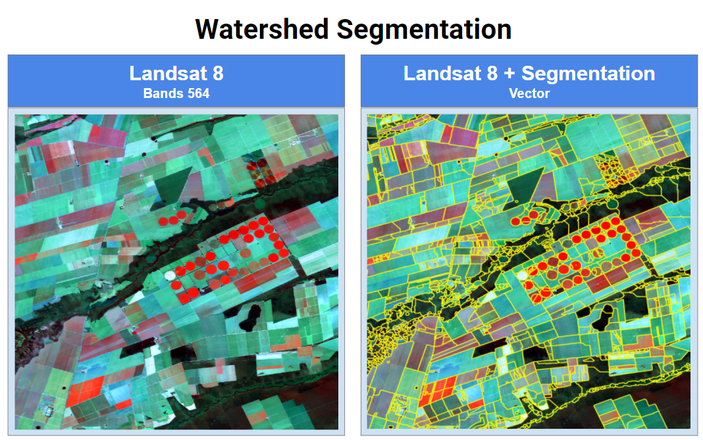

### Requirements
* GDAL -- [Homepage](http://www.gdal.org)
* Scikit-image -- [Homepage](https://scikit-image.org/)

### Install Gdal
Get gdal development libraries:
```shell
$ sudo apt-add-repository ppa:ubuntugis/ubuntugis-unstable
$ sudo apt-get update
$ sudo apt-get install libgdal-dev
$ sudo apt-get install python3-dev
$ sudo apt-get install gdal-bin python3-gdal
```


### Install virtual enviroment

```shell
$ sudo apt-get install virtualenv
```


### Create and activate a virtual environment
```shell
$ virtualenv env -p python3
$ source env/bin/activate
```

Install Others Requirements
```shell
(env) $ pip3 install -r requirements.txt
```

### Install GDAL
```shell
(env) $ pip3 install GDAL==$(gdal-config --version) --global-option=build_ext --global-option="-I/usr/include/gdal"
```

## Usage
```shell
python3 segmentation.py --input=data/LC08_220069_20190707.tif --output=data/output.tif --scale_level=0.8 --smoth=True

python3 polygonize.py --input=data/output.tif --output=data/output.gpkg

python3 zonal_statistics.py --input_raster=data/LC08_220069_20190707.tif --input_vector=data/output.gpkg --stats min max mean

```

<a rel="license" href="http://creativecommons.org/licenses/by-nc/4.0/">
    
</a>
<br />
This work is licensed under a <a rel="license" href="http://creativecommons.org/licenses/by-nc/4.0/">Creative Commons Attribution-NonCommercial 4.0 International License</a>.
